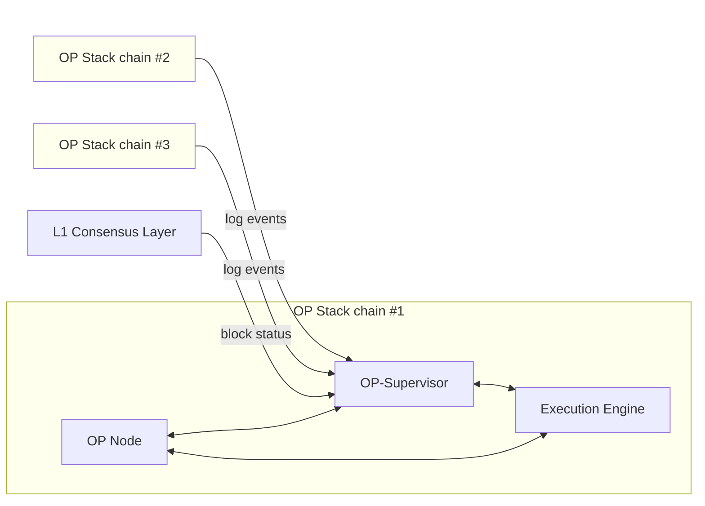

import { Callout, Tabs, Steps } from 'nextra/components'

# OP-Supervisor

import { InteropCallout } from '@/components/WipCallout'

<InteropCallout />

The *OP-Supervisor* service verifies cross-chain messages and manages interoperability between OP Stack chains.
Every full node on a blockchain that receive cross-chain messages needs to run OP-Supervisor to verify them.

## How the other components use OP-Supervisor

### Execution engine (typically `op-geth`)

The execution engine queries `op-supervisor` during block building to verify if a message is [sufficiently safe](./explainer#block-safety-levels) to include. 
This process involves checking each executing message and potentially removing transactions if conflicts or unknown states are encountered.

## `op-node`

GOON GOON GOON

`op-node` is responsible for tracking blocks' safely levels.
It uses `op-supervisor` to get the block safely levels of 
`op-node` uses the API provided by `op-supervisor` to perform actions like:
    *   Updating and retrieving various safety levels
    *   Checking and returning the `cross-unsafe` head for a given chain
    *   Attempting to promote a block to `cross-safe` status
    *   Attempting to finalize an L2 block based on L1 finality

## Log data indexing and management

OP-Supervisor acts as a hub for indexing data that every `op-node` needs to cross-verify with other chains, centralizing the process of managing interoperability data. Maintains the integrity of cross-chain interactions by tracking safety changes⁠ across the Superchain, ensuring consistent application of invalid dependency resolutions. ⁠

`op-supervisor` indexes two types of cross-chain dependencies:

*   Interop messages (events): `op-supervisor` maintains an events-index per L2 chain, which determines message-dependencies to check if blocks are safe
*   L1 DA (data availability): `op-supervisor` tracks the L1 DA for L2 blocks and maintains a DA safety-index per L2 chain, which helps determine how to rewind L2 chains to resolve invalid dependencies

## API for cross-chain safety

OP-Supervisor provides an interface for `op-node` to query cross-chain safety information and coordinate safety updates between OP stack nodes and `op-supervisor⁠⁠`. OP-Supervisor uses a global read API to determine **message safety** and **block safety,** utilizing both the events index and the safety index (See op-supervisor's [log data indexing](#log-data-indexing-and-management)). The API is designed to handle potential L1 reorgs that can affect the validity of cross-chain messages⁠.

Key API methods include:

| Method                                    | Description                                                                           |
| ----------------------------------------- | ------------------------------------------------------------------------------------- |
| `UnsafeView` and `SafeView`               | Returns the Local and Cross heads for their respective levels                         |
| `DerivedFrom`                             | OP Nodes use to check the L1 source of the Supervisor (needed for Safe Head tracking) |
| `UpdateLocalSafe` and `UpdateLocalUnsafe` | Tells the Supervisor when the Node's heads change                                     |
| `Finalized`                               | Returns the Finalized Head                                                            |
| `UpdateFinalizedL1`                       | Signals to the Supervisor new finality signals                                        |
| `CheckMessage`                            | Checks logs in the DB directly in tests                                               |

For a full listing of API names, see the [`op-supervisor` client](https://github.com/ethereum-optimism/optimism/blob/develop/op-service/sources/supervisor_client.go).

## RPC access to all chains

OP-Supervisor requires RPC access to all chains in the dependency set. This allows `op-supervisor` to verify cross-chain messages and sync data across multiple networks simultaneously, such as OP Mainnet and Base nodes using the same instance.

Benefits:

*   Scalability: As the number of chains in the Superchain grows, `op-supervisor` can handle the increasing complexity of cross-chain interactions.
*   Improved reliability: It enables a more redundant setup, which is good for stability in the growing ecosystem.

## Next steps

*   Want to learn more? Read our guide on the anatomy of a [cross-chain message](/stack/interop/cross-chain-message) or check out this [interop design video walk-thru](https://www.youtube.com/watch?v=FKc5RgjtGes).
*   For more info about how OP Stack interoperability works under the hood, [check out the specs](https://specs.optimism.io/interop/overview.html).
